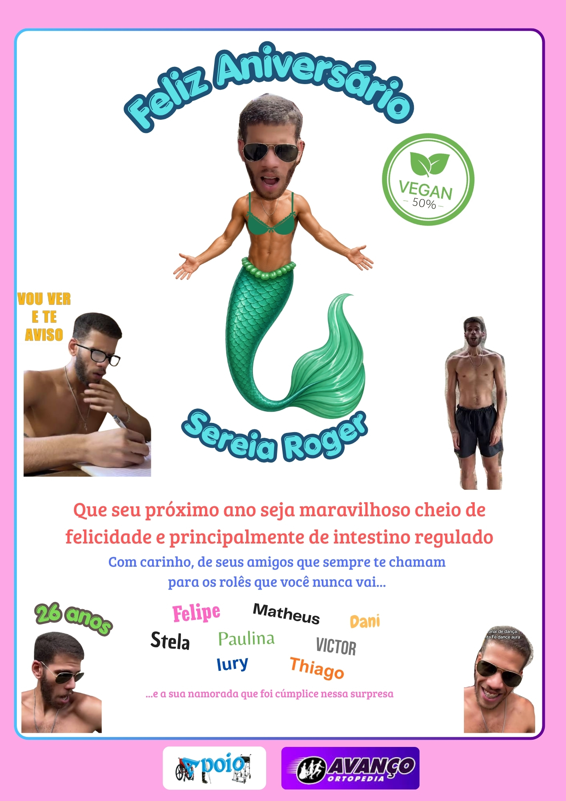

# Especificação Completa — Landing Page de Aniversário do Nicolas

> Documento de design + UX + conteúdo + comportamento + implementação para uma página de aniversário estática, construída com Vite + Vanilla JavaScript, hospedada no GitHub Pages e acessada prioritariamente pelo celular.
>
> Objetivo: transformar uma simples mensagem de aniversário em uma pequena “experiência interativa” de humor interno, usando a arte de aniversário e o vídeo já produzidos como peças centrais.

---

## 1. Visão geral

A página deve parecer uma mistura de:

- página de homenagem;
- site comemorativo;
- “documentário” sem sentido;
- interface de videogame;
- página propositalmente exagerada feita por amigos;
- experiência mobile-first com pequenas surpresas escondidas.

O humor deve vir principalmente do contraste entre uma apresentação visual relativamente bonita e textos/efeitos completamente absurdos.

A página **não deve parecer um site corporativo** e também não deve parecer um template genérico de aniversário.

A referência estética principal é a própria arte fornecida: fundo rosa, bordas coloridas, tipografia divertida, colagem de fotos, humor nonsense e elementos de “propaganda”/cartaz.

---

# 2. Objetivos do projeto

## Objetivo principal

Quando Nicolas abrir o endereço no celular, ele deve sentir que:

1. alguém preparou algo especificamente para ele;
2. a página vai ficando cada vez mais absurda conforme ele navega;
3. existem pequenas interações e piadas escondidas;
4. o vídeo e a arte são os pontos altos;
5. o final transmite genuinamente a mensagem de carinho dos amigos.

## Objetivos secundários

- funcionar perfeitamente em celular;
- carregar rapidamente pelo GitHub Pages;
- funcionar sem backend;
- não depender de banco de dados;
- funcionar mesmo sem JavaScript para o conteúdo essencial;
- ter animações leves e deliberadas;
- evitar excesso de elementos simultâneos que prejudiquem leitura;
- permitir que o autor troque textos, nomes e arquivos facilmente.

---

# 3. Informações dos assets atuais

## 3.1 Imagem principal

Arquivo atual:

`Aniversário Nicolas.jpg`

Dimensões originais:

`1414 × 2000 px`

Aspect ratio aproximado:

`0,707 : 1`

Orientação:

`Retrato`

A imagem deve ser tratada como um **cartaz oficial** e não como simples thumbnail.

### Papel na página

Ela será apresentada em destaque próximo do início da experiência.

### Tratamento recomendado

- manter proporção original;
- não esticar horizontalmente;
- não cortar informações importantes;
- usar `width: 100%` dentro de um container limitado;
- `height: auto`;
- aplicar uma sombra suave;
- borda arredondada moderada, não excessivamente moderna;
- opcionalmente adicionar um brilho/outline discreto no carregamento.

### Tamanho recomendado em mobile

Container:

`calc(100vw - 32px)`

Com margem horizontal de aproximadamente:

`16px`

Exemplo em aparelho de 390px:

`358px` de largura útil.

A imagem deverá ficar aproximadamente entre `500px` e `550px` de altura nesse viewport, preservando a proporção.

### Tamanho recomendado em desktop

Máximo:

`620px` de largura.

Nunca deixar a arte ocupar toda a largura de monitores grandes.

---

## 3.2 Vídeo

Arquivo atual:

`WhatsApp Video 2026-09-01 at 11.45.00 (1).mp4`

Informações técnicas atuais:

- resolução: `478 × 850 px`;
- orientação: retrato;
- codec de vídeo: H.264;
- áudio: AAC;
- duração aproximada: `24,93 s`;
- tamanho aproximado: `4,3 MB`.

### Papel na página

O vídeo deve entrar como um “documentário oficial” dentro de um card dedicado.

### Proporção

`478:850` ≈ `0,562:1`

Manter a proporção vertical original.

### Tamanho mobile recomendado

Largura máxima:

`min(100%, 330px)`

Altura automática.

Para um aparelho de 390px, uma largura de aproximadamente `320px` é ideal.

### Regras de reprodução

No primeiro carregamento:

- não iniciar automaticamente com áudio;
- preferir `muted` para autoplay, caso seja usado;
- usar `playsinline`;
- mostrar poster do vídeo antes da reprodução;
- manter botão visual de play próprio da página.

Ao clicar no play:

- iniciar o vídeo;
- ocultar temporariamente o overlay;
- permitir pause;
- mostrar barra de progresso discreta.

### Recomendação de UX

O vídeo deve **não parecer um player nativo cru** do navegador.

Visualmente:

```text
┌──────────────────────────┐
│                          │
│                          │
│        VÍDEO             │
│                          │
│             ▶            │
│                          │
│                          │
└──────────────────────────┘
```

Com o título fora do vídeo:

`🎬 DOCUMENTÁRIO OFICIAL`

Subtítulo:

`Uma produção que ninguém solicitou.`

---

# 4. Direção visual

## 4.1 Sensação geral

A interface deve combinar:

- rosa vibrante;
- azul/turquesa;
- roxo;
- amarelo;
- verde;
- branco;
- preto para textos de alto contraste.

As cores podem variar por seção, mas o sistema visual precisa continuar coerente.

---

# 5. Paleta de cores

## Cores principais

### Fundo externo

`#F4A1D7`

Uso:

- background geral da página;
- grandes áreas externas;
- transições entre cards.

### Fundo dos cards

`#FFFDFD`

Uso:

- cards principais;
- modais;
- seção de texto.

### Azul turquesa

`#4CCCE2`

Uso:

- títulos;
- highlights;
- bordas;
- botões secundários.

### Azul escuro

`#194F69`

Uso:

- texto principal em elementos temáticos;
- sombra de títulos;
- outlines.

### Roxo

`#6C28A8`

Uso:

- detalhes;
- bordas alternativas;
- botões de ação;
- efeitos de destaque.

### Verde

`#66B447`

Uso:

- elementos relacionados às piadas de veganismo;
- status positivos;
- badges.

### Amarelo

`#F2B632`

Uso:

- avisos;
- microtextos engraçados;
- pequenos elementos de destaque.

### Vermelho/coral

`#E85F5F`

Uso:

- mensagens de aniversário;
- alertas falsos;
- títulos de destaque.

### Texto principal

`#222222`

### Texto secundário

`#666666`

---

# 6. Tipografia

## Família principal

Preferência:

`Nunito`, `Poppins`, `Fredoka` ou fonte sans-serif arredondada equivalente.

No código:

```css
font-family: 'Nunito', 'Poppins', system-ui, sans-serif;
```

## Títulos

Usar peso entre:

`700–900`

Características:

- grandes;
- arredondados;
- divertidos;
- com sombra ou outline quando apropriado.

## Corpo

Peso:

`400–600`

Line-height:

`1.5–1.65`

## Microcopy

Pode usar `700–900` para criar sensação de cartaz.

---

# 7. Espaçamento global

Mobile:

- padding lateral: `16px`;
- espaçamento entre seções: `28–40px`;
- padding dos cards: `20–24px`;
- raio dos cards: `20–28px`.

Tablet:

- padding lateral: `24px`;
- largura máxima: aproximadamente `760px`.

Desktop:

- largura máxima total: `960–1100px`;
- conteúdo principal centralizado;
- espaçamento entre seções: `48–72px`.

---

# 8. Arquitetura geral da página

A sequência recomendada é:

```text
01. Tela de entrada
      ↓
02. Hero / Feliz aniversário
      ↓
03. Cartaz principal
      ↓
04. Mini estatísticas absurdas
      ↓
05. Documentário oficial
      ↓
06. Laudo de aniversário
      ↓
07. Histórico de rolês recusados
      ↓
08. Conquistas desbloqueadas
      ↓
09. Mensagem dos amigos
      ↓
10. Final / Parabéns
      ↓
11. Botão secreto
```

---

# 9. Seção 01 — Tela de entrada

## Objetivo

Criar curiosidade antes de mostrar a página.

## Layout mobile

Tela ocupando praticamente o viewport inteiro:

`min-height: 100svh`

Centralização horizontal e vertical.

### Elementos

Um pequeno badge no topo:

`⚠️ DOCUMENTO CONFIDENCIAL`

Título:

`NICOLAS, VOCÊ FOI SELECIONADO.`

Subtítulo:

`Uma mensagem extremamente importante foi preparada para você.`

Microtexto:

`*A qualidade do conteúdo não foi garantida.`

Botão principal:

`ENTRAR →`

### Botão

Largura:

`min(300px, calc(100vw - 48px))`

Altura:

`54–58px`

Border-radius:

`999px`

Peso da fonte:

`800`

### Animação

O botão pode ter um pequeno efeito de “respiração”:

`scale(1.00 → 1.03 → 1.00)`

Duração:

aproximadamente `1.8s`.

Não exagerar.

---

# 10. Transição da abertura

Ao clicar em `ENTRAR`:

1. botão recebe pequeno feedback visual;
2. página aplica fade-out na tela inicial;
3. background muda gradualmente;
4. conteúdo principal aparece com `fade + translateY`;
5. scroll retorna para o topo.

Duração total aproximada:

`500–800ms`.

Não usar tela branca intermediária.

---

# 11. Seção 02 — Hero

## Título

```text
🎉 FELIZ ANIVERSÁRIO,
NICOLAS! 🎂
```

O nome deve estar em tamanho maior ou cor diferente.

### Mobile

Tamanho:

`34–42px`

Line-height:

`0.95–1.05`

### Desktop

`52–68px`

### Subtítulo

```text
26 anos desbloqueados.
E aparentemente ninguém conseguiu impedir.
```

---

# 12. Seção 03 — Cartaz oficial

Usar a imagem fornecida como peça central.

Estrutura:

```text
┌─────────────────────────────┐
│                             │
│       CARTAZ OFICIAL        │
│                             │
│          [IMAGEM]           │
│                             │
│  “essa obra fala por si só” │
└─────────────────────────────┘
```

### Texto acima

`📜 DOCUMENTO OFICIAL DO ANIVERSÁRIO`

### Texto abaixo

`Produzido com carinho, Photoshop e nenhuma supervisão.`

### Interação

Ao tocar na imagem:

- abrir versão ampliada em lightbox;
- fundo preto/transparente escurecido;
- imagem centralizada;
- botão de fechar no canto superior direito.

### Fechamento do lightbox

Fechar por:

- botão `×`;
- toque fora da imagem;
- tecla `Escape` em desktop.

---

# 13. Seção 04 — Estatísticas absurdas

Essa seção deve parecer um painel de estatísticas de personagem.

Título:

`📊 STATUS ATUAL`

Subtítulo:

`Depois de 26 anos de desenvolvimento contínuo...`

Cards em mobile: 2 colunas.

Exemplo:

```text
┌──────────────┐ ┌──────────────┐
│     26       │ │    847       │
│    anos      │ │ convites     │
└──────────────┘ └──────────────┘

┌──────────────┐ ┌──────────────┐
│    96,4%     │ │     2,1%     │
│  chance de   │ │ presença em  │
│   desculpa   │ │    rolês      │
└──────────────┘ └──────────────┘
```

Os números podem ser inventados como piada.

### Importante

Não apresentar informações falsas como dados reais. O contexto visual deve deixar claro que são estatísticas humorísticas.

---

# 14. Seção 05 — Documentário oficial

## Header

Badge:

`🎬 DOCUMENTÁRIO OFICIAL`

Título:

`A origem de Nicolas`

Subtítulo:

`Uma produção cinematográfica inexplicável.`

## Card

Background:

`#111111`

Border-radius:

`24px`

Padding:

`10–14px`

O vídeo fica centralizado dentro do card.

### Overlay antes do play

Sobre o vídeo:

```text
             ▶

        APERTAR PARA
        TESTEMUNHAR
```

### Após o vídeo

Exibir pequeno texto:

`✅ Você acaba de testemunhar algo que jamais deveria ter sido produzido.`

Botão:

`ASSISTIR NOVAMENTE ↻`

---

# 15. Seção 06 — Laudo de aniversário

Essa deve ser uma das principais interações de humor.

## Cabeçalho

`🔬 LAUDO DE ANIVERSÁRIO`

Subtítulo:

`Resultado de exames altamente científicos.`

Botão:

`VER LAUDO`

Ao clicar, abrir modal.

---

# 16. Conteúdo do modal de laudo

Título:

`LAUDO DE ANIVERSÁRIO — CONFIDENCIAL`

Campos:

```text
Paciente: Nicolas
Idade: 26 anos
Status: Em funcionamento

Condição:
CRÔNICA

Prognóstico:
IRREVERSÍVEL

Nível de perturbação:
█████████░ 91%

Probabilidade de aceitar um convite:
██░░░░░░░░ 18%

Probabilidade de dizer “vou ver”:
██████████ 100%
```

### Resultado final

Em destaque:

`DIAGNÓSTICO: MAIS VELHO.`

Rodapé:

`O paciente deve ser encaminhado imediatamente para um bolo.`

Botão:

`NÃO ACEITO OS TERMOS`

Mesmo sendo engraçado, o botão simplesmente fecha o modal.

---

# 17. Seção 07 — Histórico de rolês

Título:

`🎟️ HISTÓRICO OFICIAL DE CONVITES`

Subtítulo:

`26 anos de promessas e eventos perdidos.`

Criar cards verticais.

Exemplo:

```text
ROLÊ #001
Churrasco
STATUS: ❌ RECUSADO

ROLÊ #002
Futebol
STATUS: ❌ “VOU VER”

ROLÊ #003
Jantar
STATUS: ❓ DESAPARECIDO

ROLÊ #004
Rolê aleatório às 23h
STATUS: ❌ “TÔ CANSADO”
```

Pode haver 4–6 itens.

Não criar uma lista gigantesca.

---

# 18. Barra de taxa de comparecimento

Abaixo dos convites:

Título:

`TAXA HISTÓRICA DE COMPARECIMENTO`

Barra:

`████░░░░░░ 21%`

Texto:

`Acima da média. Mas não muito.`

A barra deve animar quando entrar no viewport.

---

# 19. Seção 08 — Conquistas

Título:

`🏆 CONQUISTAS DESBLOQUEADAS`

Grid 2 colunas no celular.

Cada item deve parecer um achievement de videogame.

### Conquista 01

`🎂 SOBREVIVEU AOS 26`

Descrição:

`Chegou até aqui sem patch de emergência.`

### Conquista 02

`📱 IGNOROU 847 CONVITES`

Descrição:

`Persistência admirável.`

### Conquista 03

`🗣️ PROMETEU “VOU DESSA VEZ”`

Descrição:

`Uma habilidade lendária.`

### Conquista 04

`🍃 VEGAN MODE`

Descrição:

`???`

### Conquista 05

`👥 CONTINUA AMIGO DESSA GALERA`

Descrição:

`Achievement raro.`

### Conquista 06

`🔒 ???`

Descrição:

`Ainda bloqueada.`

Essa última será importante para um easter egg.

---

# 20. Easter egg da conquista secreta

A conquista `🔒 ???` deve ser clicável.

Ao clicar pela primeira vez:

```text
🔒 CONQUISTA BLOQUEADA

Você ainda não fez o necessário.
```

O texto deve sumir rapidamente.

Na terceira tentativa:

```text
VOCÊ É INSISTENTE, HEIN?
```

Na quinta tentativa:

Desbloquear:

```text
🏆 VOCÊ REALMENTE CLICOU NISSO

Parabéns.
Você desbloqueou absolutamente nada.
```

Isso é opcional, mas recomendado porque combina muito com o estilo da página.

Guardar o contador somente no estado da página ou em `localStorage`.

---

# 21. Seção 09 — Mensagem dos amigos

Essa deve ser a parte mais sentimental da página.

Depois de várias zoeiras, reduzir a quantidade de efeitos.

Título:

`💌 AGORA FALANDO SÉRIO...`

Texto:

Algo próximo de:

```text
A gente pode zoar, fazer montagem,
criar estatística inventada e produzir
vídeo completamente questionável...

mas tudo isso é porque você é importante
para essa galera.

Que seus 26 anos sejam cheios de coisas boas,
saúde, felicidade, histórias absurdas e,
principalmente, muitos momentos com quem você gosta.
```

Esse texto pode ser adaptado para a personalidade do grupo.

---

# 22. Nomes dos amigos

Usar os nomes presentes no cartaz:

- Felipe
- Matheus
- Dani
- Stela
- Paulina
- Victor
- Iury
- Tiago

Se existirem outros amigos que participaram da surpresa, adicionar.

### Visual

Cada nome pode aparecer em uma pequena “sticker”.

Não usar a mesma cor para todos.

Rotacionar cada sticker levemente entre:

`-4deg` e `+4deg`.

Isso mantém a estética de colagem do cartaz.

---

# 23. Seção 10 — Final

O final deve ser visualmente mais limpo.

Grande título:

```text
🎉 FELIZ ANIVERSÁRIO,
NICOLAS! 🎉
```

Subtítulo:

`Dos seus amigos que te chamam para os rolês que você nunca vai.`

Depois:

`❤️ 26 ANOS — QUE VENHAM OS PRÓXIMOS 26`

Adicionar confetes leves.

---

# 24. Botão final

Botão:

`COMEÇAR TUDO DE NOVO ↻`

Ação:

Voltar ao topo da página.

Usar:

```js
window.scrollTo({
  top: 0,
  behavior: 'smooth'
});
```

---

# 25. Botão secreto final

Em algum ponto próximo do footer, pequeno texto:

`não clique aqui`

Em letras pequenas.

Ao clicar:

- tela recebe um efeito rápido de “glitch”;
- toca um som curto, caso exista um áudio adequado;
- aparecem alguns emojis aleatórios;
- texto muda para:

`EU FALEI PRA NÃO CLICAR.`

Depois de aproximadamente 2 segundos:

`...mas feliz aniversário mesmo assim ❤️`

Não fazer o efeito repetidamente mais de uma vez por carregamento.

---

# 26. Footer

Footer simples.

Texto principal:

`Produzido com carinho por pessoas sem responsabilidade.`

Texto menor:

`© 2026 — Nicolas 26 anos edition`

Opcional:

`Nenhuma galinha foi consultada durante a produção.`

Essa última referência pode ser usada porque o vídeo possui a estética absurda envolvendo galinhas.

---

# 27. Responsividade

## Mobile — prioridade máxima

Breakpoints sugeridos:

```css
@media (max-width: 480px) {}
@media (min-width: 481px) and (max-width: 768px) {}
@media (min-width: 769px) {}
```

### 390px

Considerar como viewport de referência.

Regra:

Nada deve causar scroll horizontal.

Adicionar:

```css
html,
body {
  overflow-x: hidden;
}
```

Mas tratar o problema na origem, não apenas esconder overflow.

---

# 28. Layout mobile detalhado

Body:

```text
width: 100%
min-height: 100vh
```

Container:

```text
width: 100%
max-width: 720px
margin: 0 auto
padding: 16px
```

No celular:

- uma coluna;
- cards empilhados;
- estatísticas em 2 colunas;
- conquistas em 2 colunas;
- vídeo vertical;
- imagem com largura máxima;
- botões grandes para toque.

---

# 29. Área segura para toque

Todos os elementos clicáveis devem possuir pelo menos:

`44 × 44px`

Preferencialmente:

`48–56px` de altura.

Isso vale para:

- botão entrar;
- play;
- fechar modal;
- lightbox;
- conquistas;
- botões secretos.

---

# 30. Animações

As animações devem ser uma parte importante da experiência, mas não dominar a página.

## Animações principais

### Fade up

Entrada das seções:

```text
opacity: 0 → 1
transform: translateY(24px) → translateY(0)
```

Duração:

`500–700ms`

### Scale

Para imagens/cards especiais:

`0.96 → 1`

### Confete

Usar apenas em momentos específicos:

- entrada;
- final;
- conquista especial.

Evitar confete permanente.

---

# 31. Respeitar acessibilidade de movimento

Implementar:

```css
@media (prefers-reduced-motion: reduce) {
  * {
    animation-duration: 0.01ms !important;
    animation-iteration-count: 1 !important;
    scroll-behavior: auto !important;
    transition-duration: 0.01ms !important;
  }
}
```

A página deve continuar plenamente utilizável sem animações.

---

# 32. Scroll reveal

As seções podem ser reveladas à medida que entram na viewport.

Usar `IntersectionObserver`.

Estrutura:

```html
<section class="reveal">
```

Estado inicial:

```css
.reveal {
  opacity: 0;
  transform: translateY(24px);
}

.reveal.is-visible {
  opacity: 1;
  transform: translateY(0);
}
```

Não usar biblioteca somente para isso.

---

# 33. Confetes

Pode ser implementado com JavaScript puro para manter o projeto simples.

Quantidade por evento:

`30–60 partículas`

Duração:

`1.5–3s`

Não criar centenas de elementos permanentes no DOM.

Após animação:

remover os elementos.

---

# 34. Modal

O modal do laudo deve:

- ocupar viewport inteiro;
- ter backdrop semitransparente;
- manter card central;
- bloquear scroll do body enquanto aberto;
- devolver scroll ao fechar;
- fechar com Escape.

Mobile:

largura:

`calc(100% - 32px)`

Desktop:

máximo:

`520px`.

---

# 35. Lightbox da imagem

No celular:

A imagem pode ocupar até aproximadamente `92vw` de largura.

Background:

`rgba(0,0,0,.86)`

Imagem:

```css
max-width: 92vw;
max-height: 90vh;
object-fit: contain;
```

---

# 36. Header fixo

Não recomendo um navbar tradicional.

A experiência deve parecer uma história contínua.

No máximo, usar um pequeno botão flutuante no canto inferior direito para:

`↑`

Ação:

voltar ao topo.

Esse botão pode aparecer somente depois que o usuário rolar aproximadamente `500px`.

---

# 37. Música / áudio

Não iniciar música com som automaticamente.

Autoplay com áudio gera uma experiência ruim no mobile e pode ser bloqueado pelo navegador.

Caso exista uma música ou áudio interno adequado:

- botão explícito de ativação;
- salvar preferência em memória local somente durante a sessão;
- permitir desligar.

Botão:

`🔊 SOM ON`

ou

`🔇 SOM OFF`

A página não deve depender do áudio para fazer sentido.

---

# 38. Conteúdo textual sugerido

## Abertura

> ⚠️ DOCUMENTO CONFIDENCIAL
>
> NICOLAS, VOCÊ FOI SELECIONADO.
>
> Uma mensagem extremamente importante foi preparada especialmente para você.
>
> *A qualidade do conteúdo não foi garantida.*

## Hero

> 🎉 FELIZ ANIVERSÁRIO, NICOLAS!
>
> 26 anos desbloqueados.
> E aparentemente ninguém conseguiu impedir.

## Cartaz

> 📜 DOCUMENTO OFICIAL DO ANIVERSÁRIO
>
> Essa obra fala por si só.

## Vídeo

> 🎬 DOCUMENTÁRIO OFICIAL
>
> A origem de Nicolas
>
> Uma produção que ninguém solicitou.

## Laudo

> 🔬 LAUDO DE ANIVERSÁRIO
>
> Resultados cientificamente duvidosos.

## Rolês

> 🎟️ HISTÓRICO OFICIAL DE CONVITES
>
> 26 anos de promessas e eventos perdidos.

## Conquistas

> 🏆 CONQUISTAS DESBLOQUEADAS
>
> Nem todo mundo chegaria até aqui.

## Mensagem

> 💌 AGORA FALANDO SÉRIO...
>
> A gente pode zoar, fazer montagem, criar estatística inventada e produzir vídeo completamente questionável... mas tudo isso é porque você é importante para essa galera.

## Final

> 🎉 FELIZ ANIVERSÁRIO, NICOLAS! 🎉
>
> Que seus 26 sejam só o começo de muita coisa boa.
>
> ❤️ Com carinho, seus amigos.

---

# 39. Estrutura de arquivos — Vite + Vanilla JavaScript

A implementação será feita com **Vite + JavaScript puro**, sem React, Vue ou outro framework de UI.

A intenção é aproveitar o Vite para desenvolvimento local, build, organização dos módulos e deploy no GitHub Pages, mantendo a experiência extremamente leve.

Estrutura recomendada:

```text
nicolas-aniversario/
│
├── public/
│   ├── images/
│   │   ├── aniversario-nicolas.jpg
│   │   └── poster-video.jpg
│   │
│   ├── videos/
│   │   └── aniversario.mp4
│   │
│   ├── audio/
│   │   └── aniversario.mp3
│   │
│   └── favicon.svg
│
├── src/
│   ├── components/
│   │   ├── Intro.js
│   │   ├── Hero.js
│   │   ├── Poster.js
│   │   ├── Stats.js
│   │   ├── Documentary.js
│   │   ├── MedicalReport.js
│   │   ├── InviteHistory.js
│   │   ├── Achievements.js
│   │   ├── FriendsMessage.js
│   │   ├── FinalSection.js
│   │   └── EasterEggs.js
│   │
│   ├── utils/
│   │   ├── animations.js
│   │   ├── confetti.js
│   │   ├── counter.js
│   │   └── storage.js
│   │
│   ├── styles/
│   │   ├── variables.css
│   │   ├── reset.css
│   │   ├── global.css
│   │   ├── animations.css
│   │   └── responsive.css
│   │
│   ├── main.js
│   └── app.js
│
├── index.html
├── package.json
├── vite.config.js
├── .gitignore
└── README.md
```

## Por que `public/` para imagem, vídeo e áudio?

Os assets multimídia são arquivos finais que não precisam ser processados pelo JavaScript. Mantê-los em `public/` permite referenciá-los por caminhos absolutos e evita transformar vídeo e imagens grandes em dependências do bundle.

Exemplo:

```html


<video
  src="/videos/aniversario.mp4"
  poster="/images/poster-video.jpg"
  playsinline
  preload="metadata"
></video>
```

## Por que não React?

O projeto possui poucas telas, nenhuma necessidade de roteamento, nenhuma camada de dados complexa e praticamente todo o estado é local. React adicionaria uma camada de abstração que não traz benefício proporcional para esta experiência.

Vite + Vanilla JS permite manter componentes/modularização sem transformar uma página comemorativa pequena em uma aplicação excessivamente complexa.

## Regra de responsabilidade

- **HTML:** conteúdo semântico e estrutura base.
- **CSS:** identidade visual, layout, responsividade e animações.
- **JavaScript:** estado e interações.
- **Vite:** servidor local, build e empacotamento.
- **public/:** assets finais pesados.

---

# 40. HTML recomendado

O `index.html` deve ser pequeno e semântico. A montagem das seções pode ser feita pelo `src/app.js`, mas o documento deve manter um esqueleto previsível para acessibilidade e SEO.

```html
<!doctype html>
<html lang="pt-BR">
  <head>
    <meta charset="UTF-8" />
    <meta name="viewport" content="width=device-width, initial-scale=1.0" />
    <meta name="theme-color" content="#F4A1D7" />
    <meta
      name="description"
      content="Um documento extremamente confidencial preparado para o aniversário do Nicolas."
    />
    <link rel="icon" href="/favicon.svg" />
    <title>Documento Confidencial</title>
  </head>

  <body>
    <div id="app"></div>
    <script type="module" src="/src/main.js"></script>
  </body>
</html>
```

A aplicação pode então criar ou hidratar as seções dentro de `#app`.

Não criar um SPA com várias rotas: toda a experiência acontece em uma única página e a navegação é feita por scroll e overlays.

---

# 41. JavaScript — responsabilidades

O JavaScript deve cuidar somente de comportamento/interação.

Responsabilidades:

- entrada na página;
- scroll reveal;
- lightbox;
- modal;
- vídeo customizado;
- botão voltar ao topo;
- conquistas;
- easter eggs;
- confetes;
- controle opcional de áudio.

Evitar criar toda a interface via JS.

HTML deve conter o conteúdo principal.

---

# 42. Estado mínimo

Exemplo:

```js
const state = {
  introCompleted: false,
  medicalReportOpen: false,
  secretClickCount: 0,
  secretUnlocked: false,
  videoPlayed: false,
};
```

Pode ser apenas estado em memória.

`localStorage` é opcional e não necessário para a experiência principal.

---

# 43. Configuração do Vite e GitHub Pages

## `vite.config.js`

O valor de `base` deve corresponder ao nome do repositório caso o site seja hospedado como projeto no GitHub Pages.

Exemplo para um repositório chamado `project-eggshell`:

```js
import { defineConfig } from 'vite'

export default defineConfig({
  base: '/project-eggshell/',
})
```

Se o repositório for publicado como domínio raiz, a configuração pode usar `base: '/'`.

## Scripts do `package.json`

```json
{
  "scripts": {
    "dev": "vite",
    "build": "vite build",
    "preview": "vite preview"
  }
}
```

## Desenvolvimento local

```bash
npm install
npm run dev
```

## Build de produção

```bash
npm run build
npm run preview
```

## Deploy

O projeto deve ser preparado para GitHub Pages por GitHub Actions. A pipeline deve:

1. fazer checkout;
2. configurar Node.js;
3. executar `npm ci`;
4. executar `npm run build`;
5. publicar `dist/` no GitHub Pages.

Não fazer commit manual da pasta `dist/` caso a estratégia escolhida seja deploy automatizado por Actions.

## Caminhos de assets

Dentro do HTML, usar caminhos como:

```html

```

Não usar:

```html

```

`public/` é a origem no projeto, mas não aparece na URL final.

---

# 43. Performance

A página será hospedada em GitHub Pages, então é importante reduzir trabalho no carregamento.

## Imagem

Original:

`1414 × 2000`

Recomendação:

manter a original como arquivo fonte, mas considerar uma versão otimizada para web.

Idealmente:

- WebP ou AVIF;
- qualidade aproximadamente `75–85`;
- manter resolução suficiente para visualização mobile.

Uma versão com largura entre `1000` e `1200px` seria suficiente para a maior parte dos casos.

## Vídeo

O arquivo atual possui aproximadamente `4,3 MB`, o que é aceitável para uma página pessoal, mas ainda pode ser otimizado.

Se necessário:

- manter H.264;
- reduzir bitrate;
- preservar resolução vertical;
- tentar chegar a aproximadamente `2–3 MB` sem degradar visivelmente.

Não fazer recompressão desnecessária se a qualidade atual já estiver boa.

---

# 44. Lazy loading

Imagem principal:

não usar lazy loading se ela aparecer imediatamente no primeiro viewport.

Imagens que aparecem depois:

```html
loading="lazy"
```

Poster do vídeo:

usar um poster leve.

Vídeo:

não baixar integralmente antes de o usuário chegar à seção, quando possível.

---

# 45. SEO / compartilhamento

Mesmo sendo uma página pessoal, adicionar:

```html
<title>Feliz Aniversário, Nicolas! 🎂</title>
<meta name="description" content="Uma mensagem extremamente suspeita para comemorar os 26 anos do Nicolas.">
```

Também adicionar Open Graph:

```html
<meta property="og:title" content="Feliz Aniversário, Nicolas! 🎉">
<meta property="og:description" content="Uma produção completamente desnecessária para comemorar os 26 anos do Nicolas.">
<meta property="og:image" content="...">
```

Isso melhora o preview quando o link for enviado por WhatsApp ou redes sociais.

---

# 46. Favicon

Criar favicon simples.

Sugestão:

`🎂`

ou

`26`

ou uma pequena versão da cauda de sereia / elemento principal da arte.

Para praticidade, um SVG simples com `26` pode ser suficiente.

---

# 47. Acessibilidade

Todos os elementos visuais importantes devem possuir alt text.

Exemplo:

```html

```

Botões devem possuir labels claros.

Ícones sozinhos devem ter `aria-label`.

Modal deve possuir:

- `role="dialog"`;
- `aria-modal="true"`;
- título associado.

---

# 48. Regras de humor

A página deve seguir algumas regras para não perder a graça.

## Regra 1

Não colocar uma piada em absolutamente todo elemento.

É mais engraçado quando existem espaços normais entre momentos absurdos.

## Regra 2

As piadas devem ser curtas.

Uma pessoa no celular não vai ler parágrafos enormes entre uma interação e outra.

## Regra 3

Guardar as melhores piadas para:

- abertura;
- laudo;
- rolês;
- easter egg;
- final.

## Regra 4

A parte sentimental deve ser genuína.

O final deve reduzir o tom de zoeira e realmente desejar parabéns.

---

# 49. Ordem emocional da experiência

A página deve seguir aproximadamente esta curva:

```text
CURIOSIDADE
    ↓
EXPECTATIVA
    ↓
RISADA
    ↓
ABSURDO
    ↓
MAIS ABSURDO
    ↓
EASTER EGG
    ↓
CARINHO
    ↓
PARABÉNS
```

A página não deve começar sentimental demais.

O objetivo é primeiro fazer Nicolas entrar na brincadeira e depois fechar de forma genuinamente carinhosa.

---

# 50. Ordem de implementação

## Fase 1 — Estrutura

Criar:

- `index.html`;
- `styles.css`;
- `script.js`;
- pasta `assets`.

Implementar todas as seções sem animações.

## Fase 2 — Visual

Implementar:

- cores;
- tipografia;
- cards;
- spacing;
- imagem;
- vídeo.

## Fase 3 — Interação

Implementar:

- tela inicial;
- modal;
- lightbox;
- play do vídeo;
- scroll reveal;
- conquistas.

## Fase 4 — Easter eggs

Implementar:

- conquista secreta;
- botão secreto;
- efeitos;
- confetes.

## Fase 5 — Mobile QA

Testar especialmente:

- 320px;
- 360px;
- 375px;
- 390px;
- 414px;
- 430px.

## Fase 6 — Deploy

Publicar no GitHub Pages.

---

# 51. Checklist de qualidade antes do envio

## Visual

- [ ] nenhum scroll horizontal;
- [ ] imagem preserva proporção;
- [ ] vídeo preserva proporção;
- [ ] botões possuem área de toque adequada;
- [ ] texto é legível em telas pequenas;
- [ ] não há elementos cortados.

## Funcional

- [ ] botão entrar funciona;
- [ ] imagem abre em lightbox;
- [ ] vídeo reproduz;
- [ ] vídeo pode pausar;
- [ ] laudo abre;
- [ ] laudo fecha;
- [ ] rolês aparecem corretamente;
- [ ] conquistas funcionam;
- [ ] easter egg funciona;
- [ ] botão final volta ao topo.

## Performance

- [ ] imagem otimizada;
- [ ] vídeo otimizado se necessário;
- [ ] sem bibliotecas desnecessárias;
- [ ] console sem erros;
- [ ] assets carregam pelo GitHub Pages.

## Mobile

- [ ] Chrome Android;
- [ ] Safari iPhone;
- [ ] viewport pequeno;
- [ ] rotação bloqueada apenas se realmente necessário — preferencialmente não bloquear.

---

# 52. Versão final recomendada da experiência

A experiência completa ideal fica assim:

```text
┌───────────────────────────────────┐
│                                   │
│      ⚠️ DOCUMENTO CONFIDENCIAL    │
│                                   │
│  NICOLAS, VOCÊ FOI SELECIONADO.  │
│                                   │
│         [ ENTRAR → ]              │
│                                   │
└───────────────────────────────────┘

                 ↓

       🎉 FELIZ ANIVERSÁRIO!

       26 anos desbloqueados.

                 ↓

        📜 CARTAZ OFICIAL

           [ IMAGEM ]

                 ↓

          📊 STATUS ATUAL

       [26] [847] [96%] [2%]

                 ↓

       🎬 DOCUMENTÁRIO

           [ VÍDEO ]

                 ↓

         🔬 LAUDO MÉDICO

          [VER LAUDO]

                 ↓

       🎟️ HISTÓRICO DE ROLÊS

      ❌ ❌ ❓ ❌ ❌

                 ↓

        🏆 CONQUISTAS

       [🏆] [🏆]
       [🏆] [🏆]
       [🏆] [🔒]

                 ↓

       💌 AGORA FALANDO SÉRIO

       mensagem dos amigos

                 ↓

       🎉 FELIZ 26 ANOS! 🎉

                 ↓

       ❤️ COM CARINHO

                 ↓

         [ VOLTAR AO TOPO ]

                 ↓

           não clique aqui
```

---

# 53. Resultado esperado

O usuário final deve conseguir abrir o link no celular e completar toda a experiência em aproximadamente:

`3–6 minutos`

sem ser obrigado a clicar em absolutamente tudo.

A página precisa continuar divertida mesmo que ele apenas role e veja:

- abertura;
- arte;
- vídeo;
- texto;
- final.

As interações adicionais servem para recompensar a curiosidade.

---

# 54. Filosofia de implementação

A página é uma peça única de entretenimento, não um produto complexo.

Portanto:

**preferir simplicidade técnica e riqueza de experiência.**

Não introduzir:

- React sem necessidade;
- backend;
- banco de dados;
- autenticação;
- APIs externas;
- bibliotecas grandes para animações simples.

O stack ideal é:

```text
HTML
CSS
JavaScript
GitHub Pages
```

Com os próprios assets:

```text
JPG + MP4
```

Isso deixa o projeto:

- barato;
- simples;
- rápido;
- fácil de publicar;
- fácil de editar;
- excelente para uma página comemorativa pessoal.

---

# 55. Decisão estética final

A página deve deliberadamente misturar:

**50% visual bonito**

**30% absurdo**

**20% carinho genuíno**

Não transformar tudo em meme, porque o contraste é justamente o que fará as partes absurdas funcionarem.

A arte e o vídeo existentes devem continuar sendo os protagonistas; a página apenas cria uma experiência ao redor deles.

---

# 56. Resumo executivo

A página deve ser uma landing page mobile-first de aniversário composta por uma abertura interativa, um hero de aniversário, o cartaz principal, estatísticas humorísticas, um vídeo vertical apresentado como documentário, um laudo médico falso, histórico de convites recusados, conquistas de videogame, easter eggs e uma mensagem final sincera dos amigos.

O visual deve seguir a energia da arte enviada: colorido, divertido, exagerado, com estética de colagem e pequenas imperfeições intencionais.

A implementação deve ser estática, usando HTML + CSS + JavaScript, com GitHub Pages como hospedagem.

O resultado deve parecer muito mais elaborado do que realmente é: tecnicamente simples, visualmente rico e cheio de pequenas recompensas para quem interage.


---

# 57. Nome do repositório — estratégia e opções

O nome do repositório aparece publicamente no GitHub e, dependendo do deploy, pode aparecer diretamente na URL. Como o objetivo é surpreender o Nicolas, o nome não deve conter `aniversario`, `nicolas`, `birthday` ou `26`.

A melhor estratégia é usar um nome que pareça um projeto interno, arquivo confidencial ou código de operação.

## Opções recomendadas

### 1. `project-eggshell` — recomendação principal

Tem aparência de projeto real e não entrega que se trata de aniversário. Ao mesmo tempo, há uma conexão secreta com o vídeo e com o universo absurdo da página.

Nível de mistério: **9/10**

Nível de zoeira: **8/10**

### 2. `operation-eggshell`

Parece nome de operação secreta e combina perfeitamente com a tela inicial de “documento confidencial”.

Nível de mistério: **10/10**

Nível de zoeira: **9/10**

### 3. `classified-archive`

Extremamente neutro. O usuário poderia imaginar que é qualquer coisa antes de abrir.

Nível de mistério: **10/10**

Nível de zoeira: **6/10**

### 4. `incident-847`

Parece um incidente catalogado. Dentro da página, o `847` pode virar uma piada recorrente sobre a quantidade de convites recusados.

Nível de mistério: **9/10**

Nível de zoeira: **10/10**

### 5. `the-last-invitation`

Tem uma camada dupla: parece uma história ou projeto misterioso, mas depois conversa com a piada dos convites para rolê.

Nível de mistério: **8/10**

Nível de zoeira: **9/10**

## Escolha final recomendada

**`operation-eggshell`** é o melhor equilíbrio para esta página.

A experiência pode começar com:

```text
⚠️ OPERATION EGGSHELL
CLASSIFIED ACCESS ONLY
```

e só muito depois revelar que tudo aquilo era uma operação extremamente séria para desejar feliz aniversário.

## Alternativa mais técnica

Se a intenção for parecer um projeto de engenharia/infraestrutura em vez de uma brincadeira:

- `incident-847`
- `classified-archive`
- `project-omega`
- `protocol-17`
- `case-unknown`

Evitar nomes que revelem imediatamente a intenção: `nicolas-birthday`, `feliz-aniversario-nicolas`, `birthday-site`, `26-anos`, etc.

---

# 58. Decisão técnica final

Stack definitiva:

```text
Vite
  ↓
Vanilla JavaScript
  ↓
HTML semântico + CSS modular
  ↓
Assets em public/
  ↓
Build para dist/
  ↓
GitHub Actions
  ↓
GitHub Pages
```

A página deve ser tratada como uma experiência editorial/interativa, não como uma aplicação empresarial. A estrutura de código deve ser limpa o suficiente para demonstrar qualidade técnica no GitHub, mas a interface deve continuar sendo divertida, absurda e pessoal.
